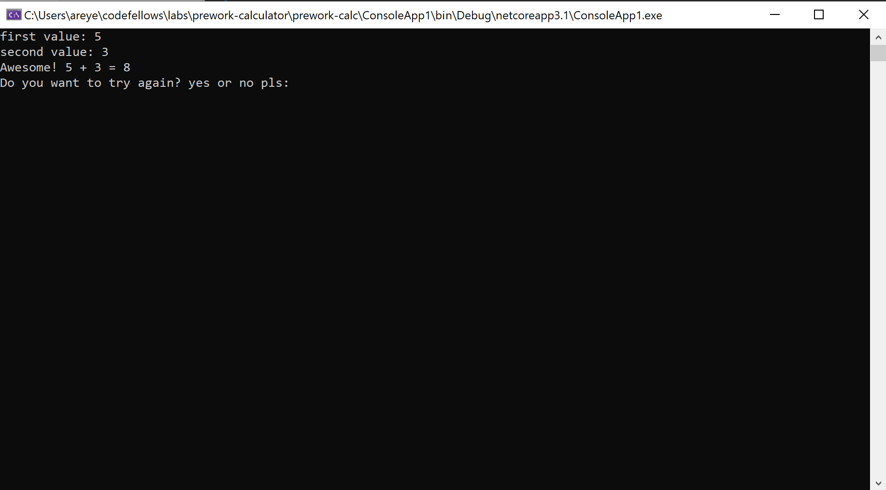

# prework-calculator
**Instructions:** User is first displayed a menu on whether they would like to add, subtract, multiply, or divide. Once user has chosen an option. They add in a first value then a second. The console then displays their inputs as well as the solution. User is then asked if they would like to try again.

### Result:

This is the menu where users can choose their options.

This is the result after user enters their first and second value. This is a sample for addition. The other options look similar however they will either subtract, multiply, or divide. 