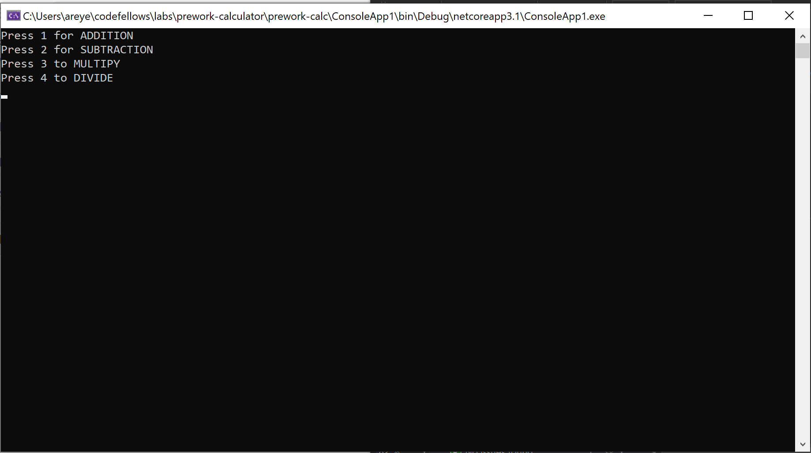
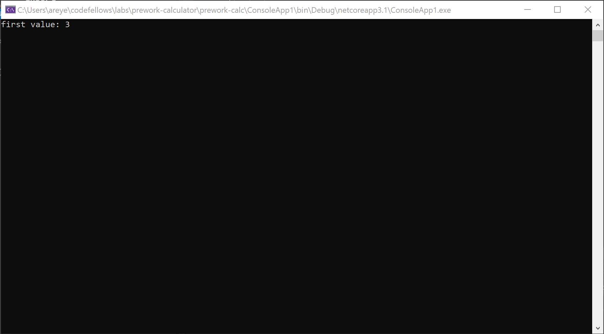
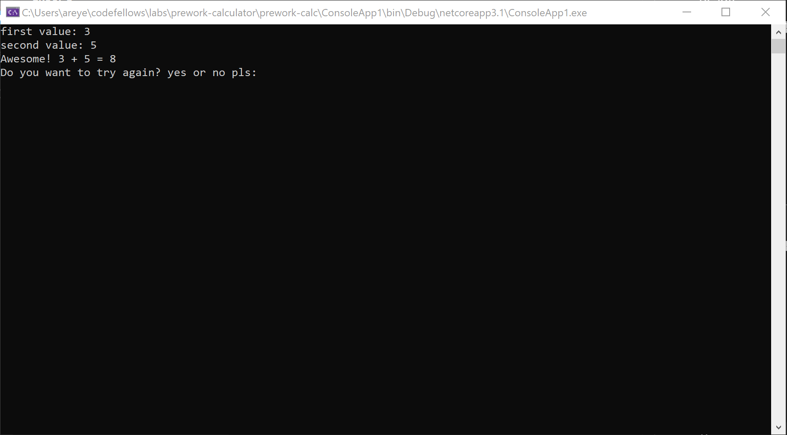

# prework-calculator
**Instructions:** User is first displayed a menu on whether they would like to add, subtract, multiply, or divide. Once user has chosen an option. They add in a first value then a second. The console then displays their inputs as well as the solution. User is then asked if they would like to try again.

### Result:

This is the menu where users can choose their options.

The user is prompted to enter their first value. 

User then enters their second value and the console displays the solution. The user is also asked if they would like to try again. If yes, they will reroute to the menu. If no, the system will exit.
